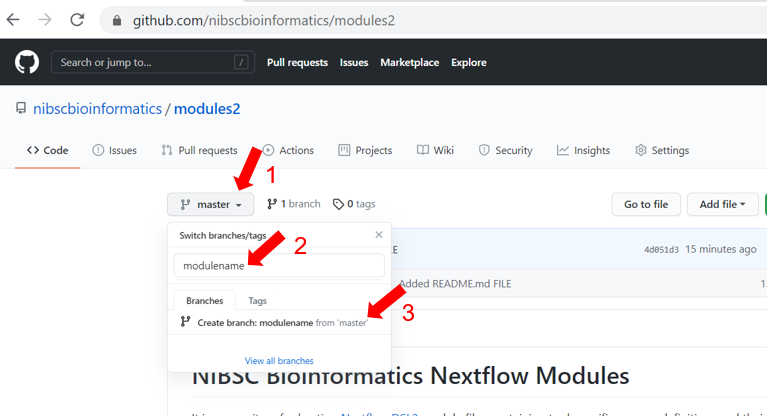

# NIBSC Bioinformatics Nextflow Modules
It is a repository for hosting [Nextflow DSL2](https://www.nextflow.io/docs/latest/dsl2.html) module files containing tool-specific process definitions and their associated documentation.

This repository has three main goals:

- to develop modules specific to the needs of NIBSC using nf-core module template
- to test modules locally and contribute to the nf-core community
- to submit modules to this repository

The nf-core community is engaged in a huge effort, to convert most pipelines to DSL2 and build all necessary modules: for this reason, beyond the scope described above, it is important to contribute rather than duplicate the efforts.

## Table of contents

- [nf-core](#nf-core)
  - [nf-core principles](#nf-core-principles)
- [How to create a new module](#How-to-create-a-new-module)
  - [Generate a module template](#generate-a-module-template)
  - [Work on module files](#work-on-module-files)
  - [Test data](#test-data)
  - [Test run the module locally](#test-run-the-module-locally)
- [How to submit module to nf-core](#submit-module-to-nf-core)
  - [Submit module to nf-core](#submit-module-to-nf-core)
- [How to add a new module to this repository](#how-to-add-a-new-module-to-this-repository)
  - [Create new branch](#create-new-branch)
  - [Submit module to this repository](#submit-module-to-this-repository)
- [Citation](#citation)

## nf-core

Before developing a new module, and unless it serves purely as learning experience, please check the list of [nf-core modules](https://github.com/nf-core/modules#checklist) to verify if the module already exists or if there is a need to add it.

### nf-core principles

In order to enable collaborations, and develop as much as possible community-standards, there is an active discussion about the principles we should all try and adhere when coding new Nextflow modules.

Please review the latest guidelines here:

[nf-core modules guidelines](https://github.com/nf-core/modules#guidelines) 


##  How to create a new module

Nf-core has made it incredibly easy for you to create a module via template.

### Generate a module template

On HPC, change to your home directory and follow the following steps:

1. Install the latest version of [`nf-core/tools`](https://github.com/nf-core/tools#installation) (`>=1.13`)
2. Install [`nextflow`](https://nf-co.re/usage/installation) (`>=20.11.0-edge`; see [Nextflow edge releases](#nextflow-edge-releases))
3. Install any of [`Docker`](https://docs.docker.com/engine/installation/), [`Singularity`](https://www.sylabs.io/guides/3.0/user-guide/) or [`Conda`](https://conda.io/miniconda.html)
4. [`Fork and clone the nf-core/modules repo locally`](https://github.com/nf-core/modules#uploading-to-nf-coremodules)
5. Change to the cloned  modules directory
6. Activate the nf-core conda environment
7. If you would like the latest development version of nf-core/tools, the command is: 
   [`pip install --upgrade --force-reinstall git+https://github.com/nf-core/tools.git@dev`]
8. Generate a module template, e.g. fastqc, by typing the following command in the local modules directory:

```console
    $ nf-core modules create . --tool fastqc --author @githubusername --label process_low --meta
                                          ,--./,-.
          ___     __   __   __   ___     /,-._.--~\
    |\ | |__  __ /  ` /  \ |__) |__         }  {
    | \| |       \__, \__/ |  \ |___     \`-._,-`-,
                                          `._,._,'

    nf-core/tools version 1.13

    INFO     Using Bioconda package: 'bioconda::fastqc=0.11.9'                      create.py:130
    INFO     Using Docker / Singularity container with tag: 'fastqc:0.11.9--0'      create.py:140
    INFO     Created / edited following files:                                      create.py:218
                ./software/fastqc/functions.nf
                ./software/fastqc/main.nf
                ./software/fastqc/meta.yml
                ./tests/software/fastqc/main.nf
                ./tests/software/fastqc/test.yml
                ./tests/config/pytest_software.yml
```

### Work on module files

There are 4 files you need to change:

    1. ./software/fastqc/main.nf

    2. ./software/fastqc/meta.yml

    3. ./tests/software/fastqc/main.nf

    4. ./tests/software/fastqc/test.yml

The [nf-core DSL2 module template](https://github.com/nf-core/tools/blob/master/nf_core/module-template/software/main.nf) has extensive TODO statements to guide you where to add which informtaion.

### Test data

Follow the [nf-core guidelines](https://github.com/nf-core/modules#test-data) for choosing test data.

### Test run the module locally

1. Install [`pytest-workflow`](https://pytest-workflow.readthedocs.io/en/stable/#installation) using conda

2. Activate the pytest-workflow conda environment

3. Change to the modules directory

4. Start running your own tests using the appropriate [`tag`](https://github.com/nf-core/modules/blob/3d720a24fd3c766ba56edf3d4e108a1c45d353b2/tests/software/fastqc/test.yml#L3-L5) defined in the `test.yml`:

    - Typical command with Docker:

        ```console
        cd /path/to/git/clone/of/nf-core/modules/
        PROFILE=docker pytest --tag fastqc_single_end --symlink --keep-workflow-wd
        ```

    - Typical command with Singularity:

        ```console
        cd /path/to/git/clone/of/nf-core/modules/
        TMPDIR=~ PROFILE=singularity pytest --tag fastqc_single_end --symlink --keep-workflow-wd
        ```

    - Typical command with Conda:

        ```console
        cd /path/to/git/clone/of/nf-core/modules/
        PROFILE=conda pytest --tag fastqc_single_end --symlink --keep-workflow-wd
        ```

    - See [docs on running pytest-workflow](https://pytest-workflow.readthedocs.io/en/stable/#running-pytest-workflow) for more info.

## How to submit module to nf-core

### Submit module to nf-core

To submit module, you need to [create a pull request](https://help.github.com/articles/creating-a-pull-request-from-a-fork/) from the forked GitHub repo.

GitHub Actions provided by GitHub automatically triggers a series of continuous integration tests on your pull request. Once all the tests are successful, your module will be reviewed and approved by nf-core members as soon as possible.  

Once approved, your module is available globally to the nextflow community to  include in a nextflow DSL2 pipeline!

## How to add a new Module to this repository

If you want to add module to this repository, you need to create a new branch as described below.

### Create a new branch

Create a new branch as shown in the picture below



with the following simple steps:

1. select the arrow next to the name of the current branch, and check you are on *master*
2. type the name of the new branch, using the name of the new module you want to create, lowercase
3. click on the line composed below, which gives the option to create a new branch with the chosen name

### Submit module to this repository

Submit module to this repository with the following steps:

1. Clone the branch locally
2. Move module files from the cloned nf-core/modules/software/modulename/ directory to modules2/software/modulename/ directory
3. Move test files from the cloned nf-core/tests/software/modulename/ directory to the modules2/test/modulename/ directory
4. Commit and push these changes to the remote branch
5. Your module filles will be reviewed and approved by the NIBSC bioinformatics members 
6. Once your module is approved, it will be merged from your branch to the master

And you are ready to include the module in a nextflow DSL2 pipeline!


## Citation

If you use the module files in this repository for your analysis please you can cite the `nf-core` publication as follows:

> **The nf-core framework for community-curated bioinformatics pipelines.**
>
> Philip Ewels, Alexander Peltzer, Sven Fillinger, Harshil Patel, Johannes Alneberg, Andreas Wilm, Maxime Ulysse Garcia, Paolo Di Tommaso & Sven Nahnsen.
>
> _Nat Biotechnol._ 2020 Feb 13. doi: [10.1038/s41587-020-0439-x](https://dx.doi.org/10.1038/s41587-020-0439-x).


